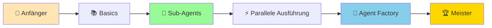
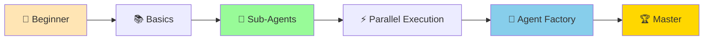

# 🚀 Das Ultimative Claude Code Cheat Sheet

<div align="center">

## 🎯 Von Oliver Hees für die KI Heroes Community

[](https://www.skool.com/ki-heroes)
[](https://ki-heroes.net)
[](https://claude.ai/code)

**[🇩🇪 Deutsch](#deutsch) | [🇬🇧 English](#english)**

---

### 💡 **Das umfassendste Claude Code Referenzwerk für Anfänger und Profis**

</div>

---

## Deutsch

### 🎓 Willkommen bei KI Heroes!

Dies ist das **ultimative Claude Code Cheat Sheet** - speziell entwickelt für unsere KI Heroes Community. Egal ob du gerade erst anfängst oder bereits fortgeschritten bist, hier findest du alles, was du brauchst, um Claude Code zu meistern!

### 🌟 Was macht dieses Cheat Sheet besonders?

- ✅ **100% Anfängerfreundlich** - Schritt-für-Schritt Anleitungen von der Installation an
- ✅ **Sub-Agents Meisterklasse** - Lerne parallele Ausführung und Agent-Patterns
- ✅ **Praxisorientiert** - Echte Beispiele mit Next.js, React und TypeScript
- ✅ **Zweisprachig** - Komplett auf Deutsch und Englisch verfügbar
- ✅ **Community-First** - Von der KI Heroes Community für die Community

### 📚 Schnellstart für Anfänger

```bash
# Claude Code in 3 Minuten installiert!
curl -sL https://install.anthropic.com | sh

# Dein erster Befehl
claude "Hallo KI Heroes!"

# Dein erstes Projekt
claude --add-dir ./mein-projekt "Erkläre mir diesen Code"
```

👉 **[Zum kompletten Anfänger-Guide →](./docs/de/00-installation-schritt-fuer-schritt.md)**

### 🗂️ Inhaltsverzeichnis

#### 🎯 **Für Einsteiger**
- [🚀 Installation Schritt-für-Schritt](./docs/de/00-installation-schritt-fuer-schritt.md)
- [👶 Erste Schritte mit Claude Code](./docs/de/01-erste-schritte.md)
- [📝 Die wichtigsten Basis-Befehle](./docs/de/02-basis-befehle.md)
- [❓ Häufige Anfängerfehler & Lösungen](./docs/de/troubleshooting-faq.md)

#### 🤖 **Sub-Agents & Parallele Ausführung** (Das Herzstück!)
- [🔥 Sub-Agents verstehen und meistern](./docs/de/03-sub-agents-meistern.md)
- [⚡ Parallele Ausführung für maximale Effizienz](./docs/de/04-parallele-ausfuehrung.md)
- [🏭 Agent Factory Patterns](./examples/sub-agents/README.md)
- [🎨 Praktische Sub-Agent Beispiele](./examples/sub-agents/praktische-beispiele.md)

#### 🚀 **Fortgeschrittene Themen**
- [🔄 Workflow Patterns](./docs/de/05-workflow-patterns.md)
- [✨ Best Practices](./docs/de/06-best-practices.md)
- [🛠️ Troubleshooting & FAQ](./docs/de/07-troubleshooting-faq.md)

### 🤖 Sub-Agents: Die Revolution in der KI-Entwicklung

Sub-Agents sind das Geheimnis für 10x schnellere Entwicklung! Hier ein Beispiel:

```javascript
// Parallele Sub-Agent Ausführung in Next.js
const agents = {
  codeReviewer: "Review den Code auf Best Practices",
  testGenerator: "Erstelle Unit Tests",
  docWriter: "Schreibe die Dokumentation",
  optimizer: "Optimiere die Performance"
};

// Alle Agents arbeiten GLEICHZEITIG! 🚀
await Promise.all(Object.entries(agents).map(([agent, task]) => 
  claude.runAgent(agent, task)
));
```

### 📊 Progressive Lernebenen

| Level | Thema | Dauer | Was du lernst |
|-------|-------|-------|---------------|
| 🌱 **1** | Installation & Setup | 30 Min | Claude Code installieren und konfigurieren |
| 🌿 **2** | Erste Befehle | 1 Std | Grundlegende Befehle und Navigation |
| 🌳 **3** | Projekte verwalten | 2 Std | Mit Verzeichnissen und Dateien arbeiten |
| 🎯 **4** | Sub-Agents Basics | 3 Std | Erste Sub-Agents erstellen und nutzen |
| ⚡ **5** | Parallele Ausführung | 4 Std | Performance durch Parallelisierung |
| 🔥 **6** | Agent Factory | 1 Tag | Komplexe Agent-Patterns implementieren |
| 🚀 **7** | Workflow Automation | 2 Tage | CI/CD Integration und Automation |
| 🏆 **8** | Meisterschaft | Ongoing | Eigene Patterns und Optimierungen |

### 🎥 Video Tutorials & Community

Besuche unsere **[KI Heroes Skool Community](https://www.skool.com/ki-heroes)** für:
- 📹 Exklusive Video-Tutorials
- 💬 Live Q&A Sessions
- 🤝 Direkter Austausch mit anderen KI Heroes
- 🎁 Bonus-Content und Updates

### 💻 Praktische Beispiele

#### Beispiel 1: Dein erstes Next.js Projekt mit Claude Code

```bash
# Projekt erstellen
npx create-next-app@latest mein-projekt --typescript --tailwind --app

# Claude Code aktivieren
cd mein-projekt
claude --add-dir . "Hilf mir eine Todo-App zu bauen"

# Sub-Agent für Components
claude --agent component-builder "Erstelle eine TodoList Komponente"
```

#### Beispiel 2: Parallele Code-Review

```bash
# Mehrere Dateien gleichzeitig reviewen
claude --parallel \
  --review src/components/*.tsx \
  --check-types \
  --suggest-improvements
```

### 🛠️ Installation Quick Guide

<details>
<summary><b>🖥️ Windows Installation</b></summary>

```powershell
# PowerShell als Administrator
irm https://install.anthropic.com/windows | iex

# Verify Installation
claude --version
```
</details>

<details>
<summary><b>🍎 macOS Installation</b></summary>

```bash
# Terminal
curl -sL https://install.anthropic.com | sh

# Verify Installation
claude --version
```
</details>

<details>
<summary><b>🐧 Linux Installation</b></summary>

```bash
# Terminal
curl -sL https://install.anthropic.com | sh

# Verify Installation
claude --version
```
</details>

### 🤝 Community & Support

- 🌐 **Website**: [ki-heroes.net](https://ki-heroes.net)
- 👥 **Community**: [Skool KI Heroes](https://www.skool.com/ki-heroes)
- 📧 **Kontakt**: Über die Community-Plattform
- 🐛 **Issues**: Direkt in der Community diskutieren

### 🏆 Erfolgsgeschichten aus der Community

> "Mit den Sub-Agents spare ich täglich 3-4 Stunden Entwicklungszeit!" - *Max, KI Heroes Member*

> "Das beste Claude Code Tutorial das ich je gesehen habe. Endlich verstehe ich parallele Ausführung!" - *Sarah, KI Heroes Member*

> "Von 0 auf 100 in einer Woche. Dieses Cheat Sheet ist Gold wert!" - *Tom, KI Heroes Member*

### 📈 Deine Lernreise



### 🎯 Nächste Schritte

1. **[Starte mit der Installation](./docs/de/00-installation-schritt-fuer-schritt.md)**
2. **[Arbeite dich durch die Anfänger-Tutorials](./docs/de/01-erste-schritte.md)**
3. **[Meistere Sub-Agents](./docs/de/03-sub-agents-meistern.md)**
4. **[Tritt der Community bei](https://www.skool.com/ki-heroes)**

---

## English

### 🎓 Welcome to KI Heroes!

This is the **ultimate Claude Code Cheat Sheet** - specially developed for our KI Heroes Community. Whether you're just starting out or already advanced, you'll find everything you need to master Claude Code here!

### 🌟 What makes this Cheat Sheet special?

- ✅ **100% Beginner-friendly** - Step-by-step guides from installation onwards
- ✅ **Sub-Agents Masterclass** - Learn parallel execution and agent patterns
- ✅ **Practice-oriented** - Real examples with Next.js, React, and TypeScript
- ✅ **Bilingual** - Complete in German and English
- ✅ **Community-First** - From the KI Heroes Community for the Community

### 📚 Quick Start for Beginners

```bash
# Install Claude Code in 3 minutes!
curl -sL https://install.anthropic.com | sh

# Your first command
claude "Hello KI Heroes!"

# Your first project
claude --add-dir ./my-project "Explain this code to me"
```

👉 **[Go to complete Beginner's Guide →](./docs/en/00-installation-step-by-step.md)**

### 🗂️ Table of Contents

#### 🎯 **For Beginners**
- [🚀 Step-by-Step Installation](./docs/en/00-installation-step-by-step.md)
- [👶 First Steps with Claude Code](./docs/en/01-first-steps.md)
- [📝 Essential Basic Commands](./docs/en/02-basic-commands.md)
- [❓ Common Beginner Mistakes & Solutions](./docs/en/troubleshooting-faq.md)

#### 🤖 **Sub-Agents & Parallel Execution** (The Core!)
- [🔥 Understanding and Mastering Sub-Agents](./docs/en/03-mastering-sub-agents.md)
- [⚡ Parallel Execution for Maximum Efficiency](./docs/en/04-parallel-execution.md)
- [🏭 Agent Factory Patterns](./examples/sub-agents/README_EN.md)
- [🎨 Practical Sub-Agent Examples](./examples/sub-agents/practical-examples.md)

#### 🚀 **Advanced Topics**
- [🔄 Workflow Patterns](./docs/en/05-workflow-patterns.md)
- [✨ Best Practices](./docs/en/06-best-practices.md)
- [🛠️ Troubleshooting & FAQ](./docs/en/07-troubleshooting-faq.md)

### 🤖 Sub-Agents: The Revolution in AI Development

Sub-Agents are the secret to 10x faster development! Here's an example:

```javascript
// Parallel Sub-Agent execution in Next.js
const agents = {
  codeReviewer: "Review code for best practices",
  testGenerator: "Create unit tests",
  docWriter: "Write documentation",
  optimizer: "Optimize performance"
};

// All agents work SIMULTANEOUSLY! 🚀
await Promise.all(Object.entries(agents).map(([agent, task]) => 
  claude.runAgent(agent, task)
));
```

### 📊 Progressive Learning Levels

| Level | Topic | Duration | What you'll learn |
|-------|-------|----------|-------------------|
| 🌱 **1** | Installation & Setup | 30 Min | Install and configure Claude Code |
| 🌿 **2** | First Commands | 1 Hr | Basic commands and navigation |
| 🌳 **3** | Project Management | 2 Hrs | Working with directories and files |
| 🎯 **4** | Sub-Agents Basics | 3 Hrs | Create and use first Sub-Agents |
| ⚡ **5** | Parallel Execution | 4 Hrs | Performance through parallelization |
| 🔥 **6** | Agent Factory | 1 Day | Implement complex agent patterns |
| 🚀 **7** | Workflow Automation | 2 Days | CI/CD Integration and automation |
| 🏆 **8** | Mastery | Ongoing | Custom patterns and optimizations |

### 🎥 Video Tutorials & Community

Visit our **[KI Heroes Skool Community](https://www.skool.com/ki-heroes)** for:
- 📹 Exclusive video tutorials
- 💬 Live Q&A sessions
- 🤝 Direct exchange with other KI Heroes
- 🎁 Bonus content and updates

### 💻 Practical Examples

#### Example 1: Your first Next.js project with Claude Code

```bash
# Create project
npx create-next-app@latest my-project --typescript --tailwind --app

# Activate Claude Code
cd my-project
claude --add-dir . "Help me build a Todo app"

# Sub-Agent for Components
claude --agent component-builder "Create a TodoList component"
```

#### Example 2: Parallel Code Review

```bash
# Review multiple files simultaneously
claude --parallel \
  --review src/components/*.tsx \
  --check-types \
  --suggest-improvements
```

### 🛠️ Installation Quick Guide

<details>
<summary><b>🖥️ Windows Installation</b></summary>

```powershell
# PowerShell as Administrator
irm https://install.anthropic.com/windows | iex

# Verify Installation
claude --version
```
</details>

<details>
<summary><b>🍎 macOS Installation</b></summary>

```bash
# Terminal
curl -sL https://install.anthropic.com | sh

# Verify Installation
claude --version
```
</details>

<details>
<summary><b>🐧 Linux Installation</b></summary>

```bash
# Terminal
curl -sL https://install.anthropic.com | sh

# Verify Installation
claude --version
```
</details>

### 🤝 Community & Support

- 🌐 **Website**: [ki-heroes.net](https://ki-heroes.net)
- 👥 **Community**: [Skool KI Heroes](https://www.skool.com/ki-heroes)
- 📧 **Contact**: Via the community platform
- 🐛 **Issues**: Discuss directly in the community

### 🏆 Success Stories from the Community

> "With Sub-Agents, I save 3-4 hours of development time daily!" - *Max, KI Heroes Member*

> "The best Claude Code tutorial I've ever seen. Finally, I understand parallel execution!" - *Sarah, KI Heroes Member*

> "From 0 to 100 in a week. This Cheat Sheet is worth its weight in gold!" - *Tom, KI Heroes Member*

### 📈 Your Learning Journey



### 🎯 Next Steps

1. **[Start with Installation](./docs/en/00-installation-step-by-step.md)**
2. **[Work through the Beginner Tutorials](./docs/en/01-first-steps.md)**
3. **[Master Sub-Agents](./docs/en/03-mastering-sub-agents.md)**
4. **[Join the Community](https://www.skool.com/ki-heroes)**

---

<div align="center">

### 💖 Erstellt mit Leidenschaft von Oliver Hees für die KI Heroes Community

**[🏠 ki-heroes.net](https://ki-heroes.net) | [👥 Community](https://www.skool.com/ki-heroes)**

</div>