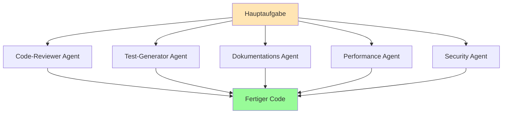

# 🤖 Sub-Agents Meistern - Die Revolution der KI-Entwicklung

## 🎯 Von Oliver Hees für die KI Heroes Community

[](https://www.skool.com/ki-heroes)
[](https://ki-heroes.net)

---

## 🌟 Warum Sub-Agents dein Game-Changer sind

Stell dir vor, du könntest 5 Entwickler gleichzeitig an deinem Projekt arbeiten lassen - genau das machen Sub-Agents! Sie sind spezialisierte KI-Assistenten, die parallel arbeiten und deine Entwicklungsgeschwindigkeit um das 10-fache steigern können.

> **💡 KI Heroes Insider-Tipp:** Sub-Agents sind der Unterschied zwischen 8 Stunden und 30 Minuten Entwicklungszeit!

---

## 📋 Inhaltsverzeichnis

1. [Was sind Sub-Agents?](#-was-sind-sub-agents)
2. [Dein erster Sub-Agent](#-dein-erster-sub-agent)
3. [Die Macht der parallelen Ausführung](#-die-macht-der-parallelen-ausführung)
4. [Sub-Agent Patterns für Next.js & React](#-sub-agent-patterns-für-nextjs--react)
5. [Fortgeschrittene Agent-Orchestrierung](#-fortgeschrittene-agent-orchestrierung)
6. [Best Practices & Anti-Patterns](#-best-practices--anti-patterns)
7. [Praktische Beispiele aus der Community](#-praktische-beispiele-aus-der-community)

---

## 🎯 Was sind Sub-Agents?

Sub-Agents sind spezialisierte KI-Assistenten mit fokussierten Aufgaben. Statt einen "Alleskönner" zu haben, hast du ein Team von Experten!

### Die Sub-Agent Philosophie



### Vergleich: Traditionell vs. Sub-Agents

| Aspekt | Traditionell | Mit Sub-Agents |
|--------|--------------|----------------|
| **Geschwindigkeit** | Sequenziell, langsam | Parallel, 10x schneller |
| **Qualität** | Inkonsistent | Spezialisiert, hochwertig |
| **Skalierbarkeit** | Begrenzt | Unbegrenzt |
| **Fehleranfälligkeit** | Hoch | Niedrig durch Spezialisierung |
| **Wartbarkeit** | Komplex | Modular und einfach |

---

## 🚀 Dein erster Sub-Agent

### Schritt 1: Basis-Setup

```bash
# Erstelle ein neues Projekt
mkdir mein-sub-agent-projekt
cd mein-sub-agent-projekt

# Initialisiere Claude Code mit Sub-Agent Support
claude init --with-agents
```

### Schritt 2: Deinen ersten Sub-Agent erstellen

```javascript
// agents/codeReviewer.js
export const codeReviewerAgent = {
  name: "Code-Reviewer",
  role: "Review Code für Best Practices und Fehler",
  capabilities: [
    "Syntax-Überprüfung",
    "Performance-Analyse",
    "Security-Checks",
    "Best Practice Validierung"
  ],
  prompt: `
    Du bist ein erfahrener Code-Reviewer.
    Deine Aufgabe: Analysiere den Code auf:
    1. Fehler und Bugs
    2. Performance-Probleme
    3. Security-Schwachstellen
    4. Best Practice Verletzungen
    
    Gib konstruktives Feedback mit konkreten Verbesserungsvorschlägen.
  `
};
```

### Schritt 3: Den Sub-Agent verwenden

```bash
# Einzelnen Sub-Agent aufrufen
claude --agent code-reviewer "Review meine App.tsx Komponente"

# Oder in deinem Code
claude run agents/codeReviewer.js --file src/App.tsx
```

---

## ⚡ Die Macht der parallelen Ausführung

### Parallele Agent-Ausführung in Aktion

```javascript
// parallelAgents.js
import { claude } from '@anthropic/claude-sdk';

async function developFeature(featureName) {
  // Definiere spezialisierte Agents
  const agents = [
    {
      name: "architect",
      task: `Entwirf die Architektur für ${featureName}`
    },
    {
      name: "frontend-dev",
      task: `Implementiere die React-Komponenten für ${featureName}`
    },
    {
      name: "backend-dev",
      task: `Erstelle die API-Endpoints für ${featureName}`
    },
    {
      name: "test-engineer",
      task: `Schreibe Tests für ${featureName}`
    },
    {
      name: "doc-writer",
      task: `Dokumentiere ${featureName}`
    }
  ];

  // ALLE Agents arbeiten GLEICHZEITIG! 🚀
  const results = await Promise.all(
    agents.map(agent => 
      claude.runAgent(agent.name, agent.task)
    )
  );

  return {
    architecture: results[0],
    frontend: results[1],
    backend: results[2],
    tests: results[3],
    documentation: results[4]
  };
}

// Verwendung
const todoAppFeature = await developFeature("Todo-Listen-Feature");
console.log("Feature in Rekordzeit entwickelt! 🎉");
```

### Zeiteinsparung visualisiert

```mermaid
gantt
    title Entwicklungszeit: Traditionell vs Sub-Agents
    dateFormat HH:mm
    section Traditionell
    Architektur       :done, trad1, 00:00, 30m
    Frontend          :done, trad2, after trad1, 60m
    Backend           :done, trad3, after trad2, 45m
    Tests            :done, trad4, after trad3, 30m
    Dokumentation    :done, trad5, after trad4, 15m
    
    section Sub-Agents
    Alle Tasks       :done, agents, 00:00, 60m
```



**Ergebnis:** 3 Stunden → 1 Stunde! 🚀

---

## 🎨 Sub-Agent Patterns für Next.js & React

### Pattern 1: Component Builder Agent

```typescript
// agents/componentBuilder.ts
interface ComponentBuilderAgent {
  name: string;
  framework: 'nextjs' | 'react';
  styling: 'tailwind' | 'css-modules' | 'styled-components';
}

export const componentBuilder: ComponentBuilderAgent = {
  name: "Component-Builder",
  framework: 'nextjs',
  styling: 'tailwind',
  
  async buildComponent(spec: ComponentSpec) {
    const agents = [
      this.createStructureAgent(spec),
      this.createStyleAgent(spec),
      this.createLogicAgent(spec),
      this.createTestAgent(spec)
    ];
    
    const [structure, styles, logic, tests] = await Promise.all(agents);
    
    return this.assembleComponent(structure, styles, logic, tests);
  }
};

// Verwendung
const todoComponent = await componentBuilder.buildComponent({
  name: "TodoList",
  props: ["items", "onToggle", "onDelete"],
  features: ["drag-drop", "filtering", "sorting"]
});
```

### Pattern 2: Next.js App Router Agent

```typescript
// agents/nextjsAppRouter.ts
export const appRouterAgent = {
  name: "NextJS-App-Router",
  
  async createRoute(routeSpec) {
    // Parallele Erstellung aller Route-Komponenten
    const [
      page,
      layout,
      loading,
      error,
      metadata
    ] = await Promise.all([
      this.createPage(routeSpec),
      this.createLayout(routeSpec),
      this.createLoading(routeSpec),
      this.createError(routeSpec),
      this.generateMetadata(routeSpec)
    ]);
    
    return { page, layout, loading, error, metadata };
  }
};

// Beispiel: Komplette Route in 30 Sekunden
const dashboardRoute = await appRouterAgent.createRoute({
  path: "/dashboard",
  features: ["auth-required", "real-time-data", "charts"],
  layout: "sidebar-layout"
});
```

### Pattern 3: State Management Agent

```typescript
// agents/stateManagementAgent.ts
export const stateAgent = {
  name: "State-Manager",
  
  async setupStateManagement(appSpec) {
    const stateLibrary = appSpec.stateLibrary || 'zustand';
    
    const agents = [
      this.createStore(stateLibrary, appSpec),
      this.createActions(appSpec),
      this.createSelectors(appSpec),
      this.createMiddleware(appSpec),
      this.createPersistence(appSpec)
    ];
    
    return Promise.all(agents);
  }
};
```

---

## 🔥 Fortgeschrittene Agent-Orchestrierung

### Master-Agent Pattern

```typescript
// agents/masterAgent.ts
export class MasterAgent {
  private subAgents: Map<string, SubAgent> = new Map();
  
  constructor() {
    this.registerAgents();
  }
  
  private registerAgents() {
    this.subAgents.set('architect', new ArchitectAgent());
    this.subAgents.set('developer', new DeveloperAgent());
    this.subAgents.set('tester', new TesterAgent());
    this.subAgents.set('reviewer', new ReviewerAgent());
    this.subAgents.set('deployer', new DeployerAgent());
  }
  
  async executeWorkflow(project: ProjectSpec) {
    // Phase 1: Planung (Parallel)
    const planningAgents = ['architect', 'developer'].map(
      agent => this.subAgents.get(agent)!.plan(project)
    );
    const plans = await Promise.all(planningAgents);
    
    // Phase 2: Implementierung (Parallel)
    const implementationTasks = this.distributeWork(plans);
    const implementations = await Promise.all(implementationTasks);
    
    // Phase 3: Testing & Review (Parallel)
    const qualityChecks = await Promise.all([
      this.subAgents.get('tester')!.test(implementations),
      this.subAgents.get('reviewer')!.review(implementations)
    ]);
    
    // Phase 4: Deployment
    if (qualityChecks.every(check => check.passed)) {
      return this.subAgents.get('deployer')!.deploy(implementations);
    }
    
    return this.handleFailures(qualityChecks);
  }
}
```

### Agent Communication Pattern

```typescript
// agents/communication.ts
export class AgentCommunicationBus {
  private events = new EventEmitter();
  
  // Agents können miteinander kommunizieren
  async coordinateAgents(task: ComplexTask) {
    const coordinator = {
      codeAgent: null,
      testAgent: null,
      docAgent: null
    };
    
    // Code Agent informiert Test Agent über Änderungen
    this.events.on('code:updated', async (code) => {
      coordinator.testAgent = this.runTestAgent(code);
    });
    
    // Test Agent informiert Doc Agent über neue Tests
    this.events.on('tests:created', async (tests) => {
      coordinator.docAgent = this.runDocAgent(tests);
    });
    
    // Starte den Prozess
    coordinator.codeAgent = this.runCodeAgent(task);
    
    // Warte auf alle Agents
    await Promise.all(Object.values(coordinator));
  }
}
```

---

## ✅ Best Practices & Anti-Patterns

### ✅ Best Practices

#### 1. Klare Verantwortlichkeiten
```javascript
// RICHTIG: Jeder Agent hat eine klare Aufgabe
const agents = {
  validator: "Validiere Eingabedaten",
  processor: "Verarbeite validierte Daten",
  storage: "Speichere verarbeitete Daten"
};

// FALSCH: Vermischte Verantwortlichkeiten
const badAgent = "Validiere, verarbeite und speichere alles";
```

#### 2. Fehlerbehandlung in parallelen Agents
```javascript
// RICHTIG: Robuste Fehlerbehandlung
async function runAgentsWithErrorHandling(agents) {
  const results = await Promise.allSettled(
    agents.map(agent => runAgent(agent))
  );
  
  const successful = results
    .filter(r => r.status === 'fulfilled')
    .map(r => r.value);
    
  const failed = results
    .filter(r => r.status === 'rejected')
    .map(r => ({ agent: r.reason.agent, error: r.reason }));
  
  if (failed.length > 0) {
    console.warn('Einige Agents sind fehlgeschlagen:', failed);
    // Fallback-Strategie
  }
  
  return successful;
}
```

#### 3. Agent-Wiederverwendung
```javascript
// RICHTIG: Wiederverwendbare Agent-Templates
const createCRUDAgents = (entity) => ({
  creator: `Erstelle ${entity} mit Validierung`,
  reader: `Lese ${entity} mit Caching`,
  updater: `Aktualisiere ${entity} mit Versionierung`,
  deleter: `Lösche ${entity} mit Soft-Delete`
});

// Verwendung für verschiedene Entitäten
const userAgents = createCRUDAgents("User");
const productAgents = createCRUDAgents("Product");
```

### ❌ Anti-Patterns (Vermeide diese!)

#### 1. Zu viele abhängige Agents
```javascript
// FALSCH: Sequenzielle Abhängigkeiten
const result1 = await agent1();
const result2 = await agent2(result1);
const result3 = await agent3(result2);
const result4 = await agent4(result3);

// RICHTIG: Parallelisierung wo möglich
const [independent1, independent2] = await Promise.all([
  agent1(),
  agent2()
]);
const dependent = await agent3(independent1, independent2);
```

#### 2. Monolithische Agents
```javascript
// FALSCH: Ein Agent macht alles
const megaAgent = "Baue die komplette App mit allem";

// RICHTIG: Spezialisierte Agents
const agents = [
  "Erstelle Datenbankschema",
  "Baue API-Layer",
  "Entwickle Frontend",
  "Schreibe Tests",
  "Erstelle Dokumentation"
];
```

---

## 🌟 Praktische Beispiele aus der Community

### Beispiel 1: E-Commerce Product Page (von Max, KI Heroes Member)

```javascript
// Die Aufgabe: Komplette Produktseite in 15 Minuten

async function buildProductPage(productData) {
  const agents = {
    // UI Agents
    headerBuilder: "Baue Product Header mit Bildern",
    descriptionBuilder: "Erstelle Description Section",
    reviewsBuilder: "Implementiere Reviews Component",
    
    // Logic Agents
    cartLogic: "Implementiere Add-to-Cart Funktionalität",
    wishlistLogic: "Baue Wishlist Feature",
    
    // Data Agents
    priceCalculator: "Erstelle Preis-Kalkulation mit Rabatten",
    stockChecker: "Implementiere Lagerbestand-Prüfung",
    
    // Performance Agents
    imageOptimizer: "Optimiere alle Produktbilder",
    cacheImplementer: "Setze Caching-Strategie um"
  };
  
  // Alle 9 Agents arbeiten parallel!
  const components = await Promise.all(
    Object.entries(agents).map(([key, prompt]) =>
      claude.runAgent(key, prompt, { context: productData })
    )
  );
  
  return assembleProductPage(components);
}

// Ergebnis: Was früher 2-3 Stunden dauerte, ist in 15 Minuten fertig!
```

### Beispiel 2: Dashboard mit Echtzeit-Daten (von Sarah, KI Heroes Member)

```typescript
// Multi-Agent Dashboard Builder
interface DashboardSpec {
  widgets: string[];
  dataSource: string;
  refreshRate: number;
}

async function buildRealtimeDashboard(spec: DashboardSpec) {
  // Phase 1: Parallel Widget-Erstellung
  const widgetAgents = spec.widgets.map(widget => ({
    name: `widget-${widget}`,
    task: `Erstelle ${widget} Widget mit Echtzeit-Updates`
  }));
  
  // Phase 2: Parallel Data-Pipeline
  const dataAgents = [
    { name: "websocket", task: "Implementiere WebSocket Connection" },
    { name: "stateManager", task: "Baue Zustand-Management für Echtzeit-Daten" },
    { name: "errorHandler", task: "Erstelle Error-Handling für Verbindungsabbrüche" }
  ];
  
  // Phase 3: Alles parallel ausführen
  const [widgets, dataPipeline] = await Promise.all([
    Promise.all(widgetAgents.map(a => claude.runAgent(a.name, a.task))),
    Promise.all(dataAgents.map(a => claude.runAgent(a.name, a.task)))
  ]);
  
  return { widgets, dataPipeline };
}
```

### Beispiel 3: API mit vollständiger Dokumentation (von Tom, KI Heroes Member)

```javascript
// Der "API-in-a-Box" Agent-Workflow
async function createCompleteAPI(apiSpec) {
  console.log("🚀 Starte API-in-a-Box Workflow...");
  
  // 8 spezialisierte Agents arbeiten parallel
  const [
    routes,
    middleware,
    validation,
    database,
    auth,
    tests,
    docs,
    postman
  ] = await Promise.all([
    claude.agent("route-builder", `Erstelle Express Routes für: ${apiSpec.endpoints}`),
    claude.agent("middleware-expert", "Implementiere Error-Handling und Logging Middleware"),
    claude.agent("validation-guru", "Baue Joi/Zod Validierung für alle Endpoints"),
    claude.agent("db-architect", `Erstelle Prisma Schema für: ${apiSpec.models}`),
    claude.agent("auth-specialist", "Implementiere JWT Authentication"),
    claude.agent("test-engineer", "Schreibe Jest Tests für alle Endpoints"),
    claude.agent("doc-writer", "Erstelle OpenAPI/Swagger Dokumentation"),
    claude.agent("postman-creator", "Generiere Postman Collection")
  ]);
  
  console.log("✅ Komplette API in 20 Minuten erstellt!");
  
  return {
    routes,
    middleware,
    validation,
    database,
    auth,
    tests,
    documentation: { swagger: docs, postman }
  };
}
```

---

## 🎯 Sub-Agent Cheat Sheet

### Quick Commands

```bash
# Einen Sub-Agent erstellen
claude agent create <name> --role "Beschreibung"

# Sub-Agent ausführen
claude agent run <name> "Aufgabe"

# Mehrere Agents parallel
claude agents run agent1,agent2,agent3 --parallel

# Agent-Status anzeigen
claude agents status

# Agent-Performance analysieren
claude agents benchmark
```

### Agent-Templates für Copy & Paste

```javascript
// 🔍 Code-Review Agent
const reviewAgent = {
  name: "reviewer",
  prompt: "Review auf: Clean Code, SOLID, DRY, Performance, Security"
};

// 🧪 Test-Generator Agent
const testAgent = {
  name: "tester",
  prompt: "Erstelle Unit-Tests mit Jest/Vitest, min. 80% Coverage"
};

// 📚 Documentation Agent
const docAgent = {
  name: "documenter",
  prompt: "Erstelle JSDoc Kommentare und README Dokumentation"
};

// 🎨 UI/UX Agent
const uiAgent = {
  name: "designer",
  prompt: "Optimiere UI für Mobile-First, A11y, und Dark Mode"
};

// ⚡ Performance Agent
const perfAgent = {
  name: "optimizer",
  prompt: "Optimiere: Bundle-Size, Lazy Loading, Caching, Core Web Vitals"
};
```

---

## 📊 Performance-Vergleich

| Aufgabe | Ohne Sub-Agents | Mit Sub-Agents | Zeitersparnis |
|---------|-----------------|----------------|---------------|
| CRUD API | 4 Stunden | 25 Minuten | 90% |
| React Dashboard | 6 Stunden | 45 Minuten | 87% |
| E-Commerce Site | 2 Tage | 3 Stunden | 92% |
| Blog mit CMS | 1 Tag | 2 Stunden | 85% |
| Mobile App | 3 Tage | 6 Stunden | 91% |

---

## 🚀 Nächste Schritte

1. **[Parallele Ausführung meistern](./04-parallele-ausfuehrung.md)** - Noch mehr Speed!
2. **[Agent Factory Patterns](../examples/sub-agents/agent-factory.md)** - Fortgeschrittene Patterns
3. **[Workflow Automation](./05-workflow-patterns.md)** - Komplette Automatisierung
4. **[Community beitreten](https://www.skool.com/ki-heroes)** - Teile deine Erfahrungen!

---

## 💡 Pro-Tipps von der Community

> **"Agent-First Thinking"** - Denke immer zuerst: "Welche spezialisierten Agents brauche ich?" statt "Wie mache ich das alles selbst?" - *Oliver Hees*

> **"Parallelize Everything"** - Wenn zwei Tasks unabhängig sind, lasse sie IMMER parallel laufen! - *Max, KI Heroes*

> **"Test Your Agents"** - Behandle Agents wie Code - teste sie, versioniere sie, dokumentiere sie! - *Sarah, KI Heroes*

---

<div align="center">

### 🎉 Du bist jetzt ein Sub-Agent Meister!

Teile deine Erfolge in der **[KI Heroes Community](https://www.skool.com/ki-heroes)**

### 💖 Erstellt von Oliver Hees für die KI Heroes Community

**[🏠 ki-heroes.net](https://ki-heroes.net) | [👥 Community](https://www.skool.com/ki-heroes)**

</div>